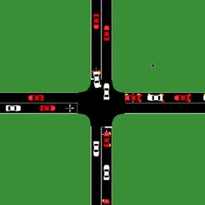
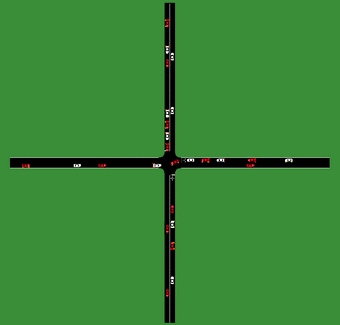

# Multi-Agent Reinforcement Learning for Mixed-Autonomy Unsignalized Intersections

**Master's Thesis Project — Thanh Tung Nguyen**  
Technische Hochschule Ingolstadt (THI) · Automated Driving and Vehicle Safety  
Submitted: May 2026

<p align="center">
  
</p>

<p align="center">
  <strong>PPO · Multi-Agent RL · Transformer · KNN Observation · SUMO · Mixed Autonomy</strong>
</p>

This repository contains the implementation, experiments, evaluation scripts, and selected results from my master's thesis on **decentralized multi-agent reinforcement learning for behavioral control in mixed-autonomy, unsignalized intersections**.

The project studies whether reinforcement-learning-controlled autonomous vehicles can coordinate traffic safely and efficiently when the environment is made substantially more realistic through **left/straight/right turning traffic, stochastic Poisson arrivals, mixed human/AV interaction, richer spatial observations, and imperfect V2V communication**.

> **Research basis:** this project extends the open-source framework from Zhongxia Yan and Cathy Wu, *Reinforcement Learning for Mixed Autonomy Intersections* (IEEE ITSC 2021).  
> Upstream repository: https://github.com/ZhongxiaYan/mixed_autonomy_intersections

---

## What I Extended

Compared with the original straight-traffic, deterministic setup, my thesis adds:

- **Unrestricted intersection movement** — left, straight, and right turns
- **Stochastic demand** — Poisson-distributed vehicle arrivals
- **50% autonomous-vehicle penetration** in mixed traffic
- **PPO Actor-Critic training** with GAE and shared policy parameters
- **MLP vs. Transformer feature extraction**
- **Platoon vs. K-Nearest-Neighbor observation spaces**
- **5-action longitudinal control**
- **Cooperative and safety-aware reward engineering**
- **Automated evaluation across varying traffic flows**
- **V2V packet-loss robustness testing**

The goal was not only to maximize throughput, but to study the difficult **safety-throughput trade-off** that emerges when autonomous agents coordinate with human-driven vehicles.

---

## Simulation Demo

<p align="center">
  
</p>

The extended environment is a four-way unsignalized intersection with mixed autonomous and human-driven traffic. AVs are controlled by a shared reinforcement-learning policy, while human-driven vehicles follow SUMO microscopic traffic models.

---

## Core Methodology

### PPO-based multi-agent control

The project progresses from a Policy Gradient / REINFORCE baseline to **Proximal Policy Optimization (PPO)** using:

- clipped PPO objective
- Actor-Critic architecture
- Generalized Advantage Estimation (GAE)
- Adam optimization
- entropy regularization
- value-function learning
- mini-batch optimization
- multiple simulation rollouts per update
- parameter sharing across autonomous vehicles

The AVs are decentralized at execution time: each controlled vehicle acts from its local observation while all AVs share the same learned policy.

### MLP vs. Embedded Transformer

I evaluated two feature-extraction approaches.

**MLP baseline:** a fixed-size traffic observation is flattened and processed by a feed-forward network before reaching the Actor and Critic heads.

**Embedded Transformer:** each observed vehicle is first mapped into a learned embedding and processed with multi-head self-attention. This allows the policy to learn which surrounding vehicles are most relevant to the ego AV rather than assigning equal importance to every observation slot.

---

## Observation-Space Design

### Platoon-based observation

The first representation extends the chain/platoon abstraction from the upstream work. For surrounding traffic, the policy observes features including vehicle speed, distance to the junction, turning intention, and distance to the ego vehicle.

This is compact, but complex turning traffic can introduce spatial blind spots.

### K-Nearest-Neighbor observation

I therefore redesigned the state representation using an ego-centric **K-Nearest-Neighbor (KNN)** observation.

At each simulation step, the environment:

1. gathers nearby vehicles,
2. computes spatial proximity,
3. filters vehicles using heading and relative motion,
4. sorts candidates by distance,
5. keeps the K most relevant neighbors,
6. normalizes their features, and
7. pads sparse scenes to keep a fixed-size input.

Each observed vehicle is represented by a compact feature vector containing relative distance, speed, turning intention, heading information, and distance to the junction.

This representation was designed to pair naturally with self-attention.

---

## Action Space

The original 3-action controller was extended to five longitudinal acceleration commands:

```text
-4.5 m/s²
-3.5 m/s²
 0.0 m/s²
+1.5 m/s²
+2.6 m/s²
```

The additional acceleration and braking levels give the agents more control authority for gap acceptance and collision avoidance in dense multi-directional traffic.

---

## Reward Engineering

A major part of the thesis was diagnosing unwanted emergent behavior and redesigning the reward function.

The reward evolved from a simple global throughput signal toward a cooperative structure containing:

- arrival rewards
- cooperative reward for human-vehicle throughput
- direct collision penalties
- spatially distributed indirect collision penalties
- adaptive collision-penalty growth
- stagnation penalties
- speed rewards when the forward path is clear

Two important failure modes appeared during experimentation:

**Reward hacking:** agents could increase throughput by driving too aggressively and accepting collisions.

**Parking behavior:** excessively large collision penalties caused agents to minimize risk by stopping almost completely.

These experiments showed that scalar reward tuning alone could not solve the task; observation quality and feature extraction were equally important.

---

## Selected Results

### KNN + Transformer improved state-value estimation

With the KNN-Transformer architecture, the Critic achieved **explained variance as high as ~0.90** during training, substantially stronger than the earlier MLP experiments.

### Transformer policies reached high throughput

Aggressive Transformer configurations exceeded **2,200 vehicles/hour** in some evaluations. However, the highest-throughput policies also produced unacceptable collision rates, exposing a strong safety-efficiency trade-off.

### MLP policies provided a more conservative balance

Well-tuned MLP policies achieved approximately **1,700 vehicles/hour with zero or near-zero collisions**, and around **1,800 vehicles/hour with low collision counts** in the evaluated scenarios.

### Robustness to V2V packet loss

A high-performing KNN-Transformer policy was stress-tested with simulated packet-loss levels of **5%, 10%, 20%, and 50%**.

The policy remained operational under moderate communication degradation. In the evaluated scenarios, **10–20% packet loss produced only a small throughput degradation**, while 50% loss caused a much larger performance drop.

---

## Baselines

The learned policies were compared against:

- equal-phase traffic signals
- Max-Pressure signal control
- horizontal-priority rules
- vertical-priority rules

Evaluation focused on hourly throughput, collision rate, average traffic speed, learning stability, and generalization across different traffic-flow configurations.

---

## Installation

The project is based on the SUMO/TraCI environment used by the upstream Yan & Wu implementation.

### 1. Clone the repository

```bash
git clone https://github.com/thickhoctin/mixed-autonomy-intersections-rl.git
cd mixed-autonomy-intersections-rl
```

### 2. Install Python dependencies

```bash
python3 -m pip install -r requirements.txt
```

PyTorch should be installed separately for the target CPU/CUDA environment.

### 3. Install SUMO

Legacy SUMO setup scripts inherited from the upstream project are available under `setup/`, including Ubuntu and macOS setup helpers.

For the original SUMO installation details and compatibility notes, see the upstream repository:

https://github.com/ZhongxiaYan/mixed_autonomy_intersections

---

## Training

Each experiment directory contains its own `config.yaml`.

A fresh training run follows the general form:

```bash
python3 intersection.py <EXPERIMENT_DIRECTORY>
```

For example, the final KNN-Transformer experiment is stored under:

```text
results/fourway_1x1_penetration0.5_turn_adam_ppo_transformer_13.02/
```

The helper script:

```bash
bash launch_train.sh
```

contains the configuration I used for continuing the thesis experiment. **At the moment it is configured with `load_step=300`, so it resumes from an existing checkpoint rather than starting from scratch.**

Because large `*.pth` checkpoints are intentionally excluded from this Git repository, resuming training requires restoring the corresponding checkpoint locally first.

---

## Evaluation

The evaluation helper can be run with:

```bash
bash launch_eval.sh
```

`launch_eval.sh` exposes the most important evaluation settings near the top of the file:

```bash
EXP_DIR=...
CKPT=...
FR_H=700
FR_V=700
N_ROWS=1
N_COLS=1
```

It then calls `intersection.py` with the configured checkpoint, traffic-flow rates, rollout settings, result output, vehicle-trajectory logging, and optional SUMO rendering.

> **Checkpoint note:** trained `*.pth` files are intentionally not committed to Git. Set `CKPT` to a checkpoint available in your local experiment directory before running evaluation.

---

## Experiment Outputs

Selected experiment artifacts are kept under `results/`, including:

- experiment configuration files
- training metrics
- evaluation CSV files
- SUMO network files
- selected plots and analysis outputs

Intermediate model checkpoints were removed from Git history to keep the repository lightweight.

For larger-scale reproduction, the recommended workflow is:

```text
config.yaml
    ↓
intersection.py / launch_train.sh
    ↓
local .pth checkpoints
    ↓
launch_eval.sh
    ↓
evaluation CSV + trajectory data + SUMO visualization
```

---

## Repository Structure

```text
.
├── intersection.py           # main training / evaluation entry point
├── env.py                    # mixed-autonomy environment and observations
├── exp.py                    # experiment and training logic
├── model_parameters.py       # neural-network components
├── auto_eval.py              # automated model evaluation
├── auto_eval_baseline.py     # baseline evaluation
├── check_model.py            # model inspection utilities
├── launch_train.sh           # thesis training / resume helper
├── launch_eval.sh            # evaluation helper
├── results/                  # selected experiment configs and outputs
├── setup/                    # SUMO setup inherited from upstream
├── images/                   # plots and thesis figures
├── videos/                   # SUMO simulation demonstrations
├── training_plot.ipynb       # training-result analysis
├── figures.ipynb             # visualization / plotting
└── MasterThesis_ThanhTungNguyen_00146349.pdf
```

---

## Technology Stack

**Python · PyTorch · SUMO · TraCI · PPO · Multi-Agent Reinforcement Learning · Actor-Critic · GAE · Transformers · Multi-Head Attention · KNN Observation · Ray · NumPy · Pandas · Jupyter · Matplotlib**

---

## Thesis

**Multi-Agent Reinforcement Learning for Behavioral Control in Mixed-Autonomy Unsignalized Intersections**

Master's degree program: **Automated Driving and Vehicle Safety**  
Technische Hochschule Ingolstadt

[Read the full master's thesis](MasterThesis_ThanhTungNguyen_00146349.pdf)

---

## Limitations

This repository presents **simulation-based research**, not a production or safety-certified autonomous-driving controller.

Important limitations include SUMO/IDM-based human behavior, a limited intersection topology, discrete longitudinal actions, simplified packet-loss simulation, no real-vehicle validation, and an unresolved safety-throughput trade-off in the most aggressive Transformer policies.

A major next step would be to combine learned coordination with stronger safety mechanisms such as constrained RL, explicit safety layers, temporal/graph representations, richer communication models, and hardware-in-the-loop or real-world validation.

---

## Upstream Research and Attribution

This thesis builds upon:

**Zhongxia Yan and Cathy Wu**  
*Reinforcement Learning for Mixed Autonomy Intersections*  
IEEE International Intelligent Transportation Systems Conference (ITSC), 2021

Original implementation:  
https://github.com/ZhongxiaYan/mixed_autonomy_intersections

My work extends the framework with a modified traffic environment, PPO training and tuning, richer observation representations, KNN-based spatial filtering, Transformer feature extraction, reward redesign, broader evaluation, and V2V communication robustness experiments.

---

## Author

**Thanh Tung Nguyen**

Research / engineering interests: **Reinforcement Learning · Autonomous Driving · Robotics · Machine Learning · Intelligent Transportation Systems**
